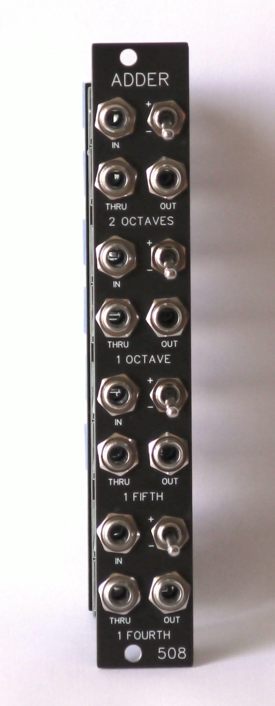
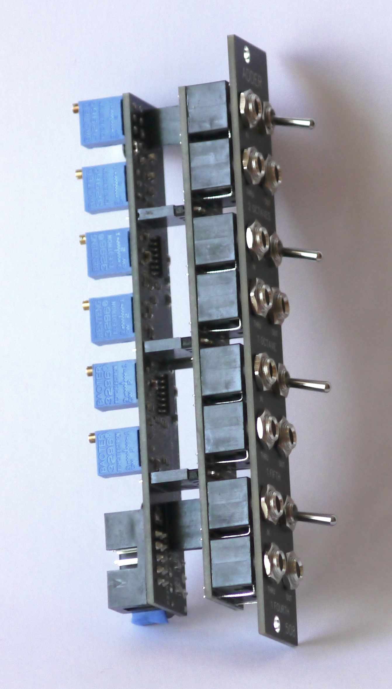

# Precision Adder v2.2
This is a precision CV source and adder. It has four independent CV inputs with passthru; each input cascades to the one below it if there's no input below.

Each section provides a different voltage to be added to the input: +/- 2v, +/- 1v, +/- .5833333v (a fifth), +/- .4166666v (a fourth)

